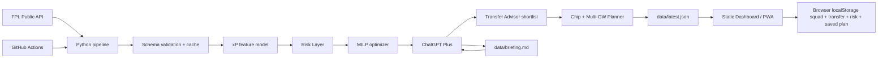

# สถาปัตยกรรมระบบและระยะที่ 1–7

## ภาพรวม

หน้า `guide.html` สร้างตอน build จากต้นฉบับเดียว `dashboard/guide.md` ด้วย
`src/fpl_mvp/guide.py` / `markdown-it-py` (ปิด raw HTML และ images, เปิดตาราง)
สร้างสารบัญตาม H2 ที่เรียงเลขและตรวจว่ามีชื่อเรื่องเดียว; ลิงก์กลับ Dashboard เป็น relative
เพื่อใช้ทั้ง local root และ GitHub Pages subpath. ไม่มี client fetch, account data หรือ storage ในคู่มือ
ยกเว้น JS ปุ่ม native print; อ่านได้เมื่อปิด JavaScript ส่วน Markdown ถูกคัดลอกให้ดาวน์โหลดตรงต้นฉบับ
build manifest รวม guide HTML/MD/CSS/JS ทั้งหมด และ hash URL บน HTML ทั้งสองหน้า
Service worker แยก navigation cache ของ guide จาก index เพื่อไม่ให้หน้าใดทับอีกหน้าเวลา offline
smoke check ตรวจไฟล์คู่มือเมื่อ index อ้างถึง แต่ยังยอมรับ artifact รุ่นก่อนที่ไม่มีเมนูนี้

Phase 7B เพิ่ม `assets/decision-card.js` ต่อจาก A/B ด้วย explicit allowlist สำหรับภาพ PNG
และข้อความ: slot, GW, ชิป, moves ปัจจุบัน, XI/C/VC/bench, คะแนนสุทธิและข้อจำกัด, snapshot/model/release.
ชื่อผู้เล่นอ่านจาก public catalog ไม่ใช้ label, risk notes หรือชื่อที่อยู่ใน record ที่บันทึก
ไม่มี Team ID/ชื่อทีม/ผู้จัดการ/งบ/ราคาขาย/context key/บันทึกส่วนตัวในไฟล์หรือชื่อไฟล์
preview อยู่ในหน่วยความจำเท่านั้น ไม่เพิ่ม storage, server, upload หรือ external dependency
ทุก export ตรวจ freshness/identity/deadline และ record equality ซ้ำ; preview เก่าถูกล้างเมื่อ context/slot/record เปลี่ยน
Canvas ใช้ฟอนต์ระบบ, wrap ภาษาไทยตาม grapheme และสูงตามเนื้อหา; PNG ไม่สำเร็จยังส่งออกข้อความได้
manifest รุ่นนี้มี 11 ไฟล์ และยังตรวจ artifact รุ่นก่อนเพื่อ rollback ได้

Phase 7A เพิ่ม `assets/scenario-compare.js` เป็น UI/logic ฝั่ง Browser แยกจาก Journal
และไม่แก้ snapshot schema. เก็บสอง frozen records ใน
`fpl-decision-lab:compare:v1:<season>:<team>:gw<gameweek>` พร้อม model/release/source timestamp,
canonical context key ของข่าวและ transfer inputs, XI/C/VC/bench, current/future moves และงบ
delta แสดงเฉพาะสอง record ที่ตรง context ปัจจุบันและผ่าน freshness/identity/deadline gates
การ capture ไม่เรียก savePlannerSettings และไม่แก้ Decision Journal; future moves ไม่รวมใน GW delta
build manifest ครอบคลุม asset ใหม่ แต่ smoke checker ยังรองรับ manifest 9 ไฟล์ของ Phase 6 เพื่อ rollback ได้



ไม่มี application server หรือ database กลาง หน้าเว็บอ่าน static JSON และเก็บทีมทดลอง
ใน Browser เท่านั้น

Phase 6 แยก `assets/runtime.js` สำหรับ compatibility/freshness/resource timeout และ
`assets/decision-log.js` สำหรับประวัติ local-first ออกจาก renderer หลัก เพิ่ม root `release.version`
โดยไม่เปลี่ยน snapshot schema v2. Browser ตรวจ major contract และ source version ใน decision
รวมถึง Team ID, Gameweek และเวลา generated_at ของ Briefing ก่อนใช้ร่วมกัน
Briefing โหลดไม่ได้เป็น partial state และปิด copy เท่านั้น; ถ้าไฟล์มาครบแต่ข้อมูลไม่ตรงจะหยุดคำแนะนำทั้งหมด

Static build ส่ง JSON แบบ compact, สร้าง content-hashed asset URLs, build fingerprint,
`build-info.json` พร้อม SHA-256 และ cache namespace ตาม scope/build ID.
Service worker ใช้ network-first มี timeout, cache เฉพาะ response สำเร็จ, ไม่ลบ cache ของแอปอื่น,
และใส่ `X-FPL-Cache: offline` เมื่อส่งข้อมูลสำรอง ทำให้หน้าเว็บไม่ตีความ cache ว่าเป็นข่าวใหม่

Decision journal ใช้ `fpl-decision-lab:decisions:v1:<season>:<team-id>` เก็บ immutable forecast
พร้อม actual result ที่ผู้ใช้รายงานเอง ไม่มีการส่งกลับ server และไม่ใช้ผลเดียวสรุปคุณภาพโมเดล

Snapshot schema v2 มี `identity`, `data_quality` และ `provenance` เป็น gate ก่อนใช้
คำแนะนำ Team ID จาก request, FPL entry, snapshot, briefing และ Team ID ที่ผู้ใช้ตั้งใจดู
ต้องตรงกันทั้งหมด หน้าเว็บจึงจะเปิด captain, optimizer, Squad Lab และ AI briefing

Phase 1 เพิ่ม root contract `gameweek_decision` ซึ่งปัจจุบันเป็นรุ่น
`gameweek-decision-5.0` โดย
`src/fpl_mvp/decision.py` รับทีมจริง 15 คนและสร้างคำตอบ Transfer, XI, Captain/Vice,
Bench, Chip, confidence, reasons, alternatives และ warnings หน้าเว็บกับ
`data/briefing.md` อ่าน contract นี้โดยตรง จึงไม่สามารถเผลอแสดง full-squad optimizer
เป็นทีมปัจจุบันของผู้ใช้ได้

Squad Lab ใช้ storage namespace รูปแบบ
`fpl-decision-lab:squad:v2:<season>:<team-id>` เพื่อป้องกันรายชื่อปะปนข้ามฤดูกาลหรือ
ข้ามบัญชี ข้อมูล v1 จะ migrate เฉพาะเมื่อ Team ID เดิมตรงกับ snapshot เท่านั้น

Phase 3 เพิ่ม `transfer-advisor-1.0` ใน
`src/fpl_mvp/transfer_advisor.py` ฝั่ง pipeline สร้าง candidate moves ที่มีผลต่าง
expected points 1/3/5 GW, downside, expected minutes และ start probability โดยอิงทีมจริง
หน้า Browser รับ Free Transfer, bank และราคาขายจริง แล้วค้น scenario Roll, 1 FT, 2 FT
และ -4 พร้อมตรวจงบ/ตำแหน่ง/โควตาสโมสรซ้ำ ข้อมูลส่วนตัวเก็บใน namespace
`fpl-decision-lab:transfers:v3:<season>:<team-id>` และไม่ถูกส่งกลับ backend

Wildcard Lab ยังใช้ full-squad optimizer แต่แยกพื้นที่และข้อความจาก Transfer Advisor
โดยชัดเจน จึงไม่ถูกนำเสนอเหมือน transfer ประจำสัปดาห์

Phase 4 เพิ่ม `risk-layer-1.0` ระหว่างโมเดลกับ decision service โดยรับ FPL status
อัตโนมัติและ curated evidence จาก `data/risk-evidence.json` ทุก record ต้องมี player,
category, source tier, URL, published time, fact/inference และ Gameweek ที่หมดอายุ
ข่าวเก่าเกิน 24 ชั่วโมง, ข่าวที่ยังไม่ถึงเวลา, override หมดอายุ หรือ record ที่ validate ไม่ผ่าน
จะถูกเก็บเพื่อ audit แต่ไม่เปลี่ยน projection หาก curated source หาย ระบบจะกลับไปใช้ FPL
availability และ uncertainty ของโมเดล พร้อมคำเตือนแทนการหยุดทั้ง pipeline

Dashboard มี evidence overlay ฝั่ง Browser ใน namespace
`fpl-decision-lab:risk:v4:<season>:<team-id>` โดยใช้ projection จาก snapshot เป็นฐานใหม่
ทุกครั้ง predicted lineup ถูกบังคับเป็น inference และจำกัดผลกระทบ ±15 นาที/±15%
เมื่อ evidence active ระบบจะคำนวณ XI, Captain/Vice, bench และ Transfer scenarios ใหม่
ใน Browser แต่ไม่เขียนทับ snapshot หรือส่งข้อมูลกลับ backend

Phase 5 เพิ่ม `chip-planner-1.0` หลัง Risk Layer โดยสร้าง XI/C/VC/bench ของทีมจริง
แยกทุก Gameweek ในช่วงโมเดล 3–6 GW ประเมิน Bench Boost, Triple Captain, Free Hit และ
Wildcard ด้วย expected gain, Gameweek ที่ดีที่สุดที่มองเห็น และ opportunity cost ประวัติชิป
จาก FPL เป็นข้อเท็จจริงและล็อกชิปที่ใช้ไปแล้ว กติกา 2026/27 กำหนดสองชุดต่อฤดูกาล,
หนึ่งชิปต่อ Gameweek, ชุดแรกไม่ยกยอด และ Free Hit ใช้ติดกันไม่ได้

transfer path หลัก/สำรองตรวจตำแหน่ง, club quota และงบหลังทุก move ด้วยราคาปัจจุบัน
แต่ยังต้องยืนยันราคาขายจริงและ FT ใน Transfer Advisor หน้า Browser เก็บแผนใน namespace
`fpl-decision-lab:planner:v5:<season>:<team-id>` และทำเครื่องหมาย stale เมื่อเปลี่ยน Gameweek
Risk override จะคำนวณ BB/TC ของ GW ปัจจุบันใหม่ทันทีโดยไม่แก้ snapshot

Production entrypoint คือ
[https://sarayutp.github.io/fpl-decision-lab/](https://sarayutp.github.io/fpl-decision-lab/)
GitHub Actions ทำ pipeline และ deploy จึงไม่พึ่ง MacBook ที่เปิดค้างไว้ การรัน local
มีไว้สำหรับพัฒนาและทดสอบเท่านั้น

## ระยะที่ 1 — Data foundation

- FPL base URL: `https://fantasy.premierleague.com/api/`
- endpoints: `bootstrap-static/`, `fixtures/`, `entry/{id}/`, `history/`,
  `transfers/`, picks หลัง deadline และ element summary เมื่อต้องใช้
- Pydantic ตรวจ field สำคัญและยอมรับ field ใหม่จาก FPL
- exponential retry, TTL cache และ stale-cache fallback
- atomic writes ป้องกัน Dashboard อ่านไฟล์ครึ่งเดียว

## ระยะที่ 2 — Explainable xP

- `forecast.py` รุ่น `xp-v2.0` แยก expected points ออกจาก ranking score
- shrink ผลงานปัจจุบันเข้าหา price/position prior ด้วย prior 900 นาที
- สร้าง expected minutes, start probability, confidence และ decision range
- ใช้ xGI/set pieces เมื่อมีข้อมูล และ blend FPL `ep_next` ครั้งเดียวต่อ Gameweek
- ปรับ fixture difficulty, venue, team strength เมื่อมีค่า, double/blank และ availability
- Captain score มี minutes/role gate และ penalty สำหรับตัวเลือกเกมรับที่หลักฐานไม่พอ
- model quality guardrail และ rolling backtest อยู่ใน `forecast.py` / `backtest.py`

## ระยะที่ 3 — Optimizer

SciPy HiGHS MILP แก้ squad, XI, captain และ vice พร้อมกัน ภายใต้งบ 100.0,
ตำแหน่ง, formation และ club quota ผลลัพธ์ผ่าน validator ซ้ำก่อนเขียน snapshot

หลังมี public picks ระบบสร้าง best XI และ affordable one-transfer suggestions โดยใช้
ราคาปัจจุบันแทน selling value ที่ public API ไม่เปิด

## ระยะที่ 4 — Dashboard/PWA

- vanilla HTML/CSS/JavaScript ไม่มี build dependency ฝั่งเว็บ
- responsive, keyboard focus, reduced-motion support
- service worker: app shell cache-first, data network-first + offline fallback
- Squad Lab ใน localStorage
- Player Explorer, captain radar, optimizer pitch และ diagnostics
- static build แบบ atomic ไปที่ `dist/`
- หน้าเริ่มต้น `This Gameweek` แสดง decision cards 5 ช่องจาก owned squad
- build gate ตรวจ version, Team ID และ target Gameweek ของ decision contract
- build gate ตรวจ `xp-v2`, score definitions, model quality และ model version ที่ decision ใช้
- build gate ตรวจ `transfer-advisor-1`, regular-transfer mode, hit cost และการแยก Wildcard

## ระยะที่ 5 — ChatGPT Plus

- สร้าง `data/briefing.md` ทุก refresh
- copy/download จาก Dashboard
- prompt บังคับแยก fact/inference, คิด hit และค้นข่าวล่าสุด
- ไม่เรียก OpenAI API และไม่มี key ในระบบ

## ระยะที่ 6 — Automation

- CI ทดสอบทุก push/PR
- GitHub Pages workflow รันตามเวลาและ manual
- test ก่อน deploy ทุกครั้ง
- Pages artifact ทำให้ไม่ต้อง commit snapshot ใหม่ทุก schedule

## ระยะที่ 7 — QA และ operations

- unit tests: API, cache, deadline boundary, xP, doubles/blanks, availability,
  optimizer, transfers และ site build
- live FPL integration run
- browser smoke/interaction/responsive tests
- `scripts/doctor.py` สำหรับตรวจเครื่อง
- คู่มือผู้ใช้, deployment, AI, model card และ troubleshooting

## ขอบเขตความปลอดภัย

- read-only public API เท่านั้น
- ไม่ทำ transfer หรือเปลี่ยน captain ใน FPL
- ไม่ขอ password/session cookie
- ไม่ส่ง squad ใน localStorage ไป backend
- user ต้องยืนยันข่าว งบขายจริง และบันทึกทีมใน FPL เอง

## โครงสร้างไฟล์

```text
src/fpl_mvp/       pipeline, models, xP, optimizer, site builder
dashboard/         static UI and service worker
data/              latest snapshot and ChatGPT briefing
dist/              generated deployable site
tests/             automated tests
.github/workflows/ CI and GitHub Pages automation
docs/              user and technical manuals
scripts/           one-command local run/update/doctor
```
