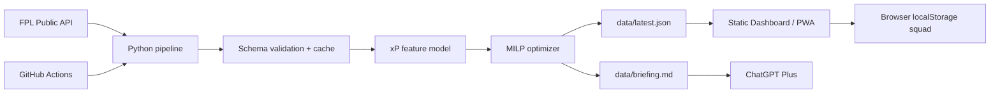

# สถาปัตยกรรมระบบและระยะที่ 1–7

## ภาพรวม



ไม่มี application server หรือ database กลาง หน้าเว็บอ่าน static JSON และเก็บทีมทดลอง
ใน Browser เท่านั้น

Production entrypoint คือ
[https://sarayutp.github.io/fpl-decision-lab/](https://sarayutp.github.io/fpl-decision-lab/)
GitHub Actions ทำ pipeline และ deploy จึงไม่พึ่ง MacBook ที่เปิดค้างไว้ การรัน local
มีไว้สำหรับพัฒนาและทดสอบเท่านั้น

## ระยะที่ 1 — Data foundation

- FPL base URL: `https://fantasy.premierleague.com/api/`
- endpoints: `bootstrap-static/`, `fixtures/`, `entry/{id}/`, `history/`,
  `transfers/`, picks หลัง deadline และ element summary เมื่อต้องใช้
- Pydantic ตรวจ field สำคัญและยอมรับ field ใหม่จาก FPL
- exponential retry, TTL cache และ stale-cache fallback
- atomic writes ป้องกัน Dashboard อ่านไฟล์ครึ่งเดียว

## ระยะที่ 2 — Explainable xP

- blend คะแนนต่อเกม, คะแนนต่อ fixture และ FPL `ep_next`
- shrink ผู้เล่น sample น้อยเข้าหาค่า season rate
- ปรับ fixture difficulty, venue, double/blank และ availability
- คำนวณ 1 GW และ horizon 5 GW
- บันทึก input ที่ใช้ต่อผู้เล่นเพื่อ audit ได้

## ระยะที่ 3 — Optimizer

SciPy HiGHS MILP แก้ squad, XI, captain และ vice พร้อมกัน ภายใต้งบ 100.0,
ตำแหน่ง, formation และ club quota ผลลัพธ์ผ่าน validator ซ้ำก่อนเขียน snapshot

หลังมี public picks ระบบสร้าง best XI และ affordable one-transfer suggestions โดยใช้
ราคาปัจจุบันแทน selling value ที่ public API ไม่เปิด

## ระยะที่ 4 — Dashboard/PWA

- vanilla HTML/CSS/JavaScript ไม่มี build dependency ฝั่งเว็บ
- responsive, keyboard focus, reduced-motion support
- service worker: app shell cache-first, data network-first + offline fallback
- Squad Lab ใน localStorage
- Player Explorer, captain radar, optimizer pitch และ diagnostics
- static build แบบ atomic ไปที่ `dist/`

## ระยะที่ 5 — ChatGPT Plus

- สร้าง `data/briefing.md` ทุก refresh
- copy/download จาก Dashboard
- prompt บังคับแยก fact/inference, คิด hit และค้นข่าวล่าสุด
- ไม่เรียก OpenAI API และไม่มี key ในระบบ

## ระยะที่ 6 — Automation

- CI ทดสอบทุก push/PR
- GitHub Pages workflow รันตามเวลาและ manual
- test ก่อน deploy ทุกครั้ง
- Pages artifact ทำให้ไม่ต้อง commit snapshot ใหม่ทุก schedule

## ระยะที่ 7 — QA และ operations

- unit tests: API, cache, deadline boundary, xP, doubles/blanks, availability,
  optimizer, transfers และ site build
- live FPL integration run
- browser smoke/interaction/responsive tests
- `scripts/doctor.py` สำหรับตรวจเครื่อง
- คู่มือผู้ใช้, deployment, AI, model card และ troubleshooting

## ขอบเขตความปลอดภัย

- read-only public API เท่านั้น
- ไม่ทำ transfer หรือเปลี่ยน captain ใน FPL
- ไม่ขอ password/session cookie
- ไม่ส่ง squad ใน localStorage ไป backend
- user ต้องยืนยันข่าว งบขายจริง และบันทึกทีมใน FPL เอง

## โครงสร้างไฟล์

```text
src/fpl_mvp/       pipeline, models, xP, optimizer, site builder
dashboard/         static UI and service worker
data/              latest snapshot and ChatGPT briefing
dist/              generated deployable site
tests/             automated tests
.github/workflows/ CI and GitHub Pages automation
docs/              user and technical manuals
scripts/           one-command local run/update/doctor
```
